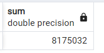
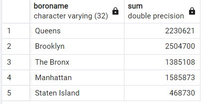
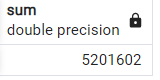
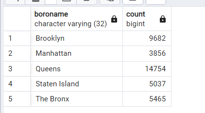

1. Ile rekordów znajduje się w tabeli nyc_streets?
odpowiedz: 19091 (17099 ulic)
2. Ile ulic w Nowym Jorku ma nazwy zaczynające się na „B”, „Q” i „M”?
odpowiedz: 2102 (na B:1282, na Q: 68, na M: 752)
3. Jaka jest populacja miasta Nowy Jork?
odpowiedz: 8175032

4. Jaka jest populacja Bronxu, Manhattanu i Queens?
odpowiedz: na Bronxie 1385108, na Manhattanie 1585873 a na Queens 2230621 

(łącznie 5201602)

5. Ile dzielnic ("neighborhoods") znajduje się w każdej gminie (borough)?
odpowiedz: Na Brooklynie: 9682, Na Manhattanie: 3856, Na Queens: 14754, Na Staten Island: 5037 , Na Bronxie: 5465